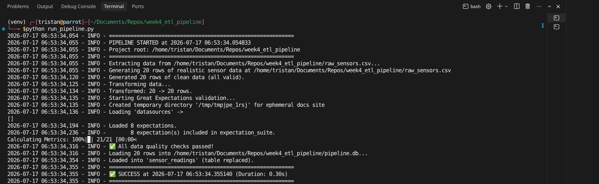
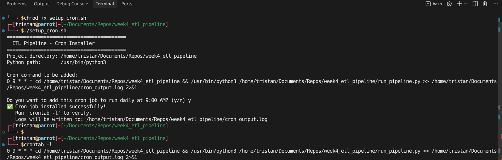
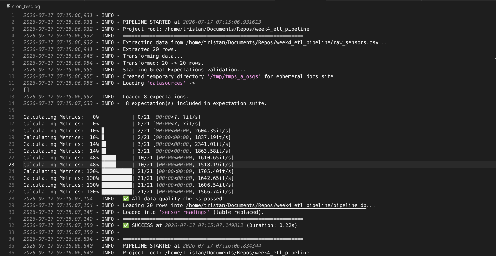

# 🚀 Week 4 ETL Pipeline

[](https://python.org)
[](https://greatexpectations.io/)
[](https://sqlite.org/)
[](https://faker.readthedocs.io/)

---

## 📖 Table of Contents
- [Overview](#overview)
- [Key Features](#key-features)
- [Technology Stack](#technology-stack)
- [Installation](#installation)
- [Configuration](#configuration)
- [Running the Pipeline](#running-the-pipeline)
- [Automation with Cron](#automation-with-cron)
- [Data Quality Suite](#data-quality-suite)
- [Logging & Monitoring](#logging--monitoring)
- [Project Structure](#project-structure)
- [Screenshots](#screenshots)
- [Troubleshooting](#troubleshooting)
- [Contributors](#contributors)

---

## 📌 Overview

This project implements a **production-grade ETL (Extract, Transform, Load)** pipeline for IoT sensor data. It is designed with **reliability**, **observability**, and **data integrity** as first-class citizens. The pipeline automatically validates incoming data against a strict quality schema, halts on failure, logs every step, and can be scheduled to run unattended via `cron`.

**Use Case:** Ingesting temperature, pressure, and humidity readings from edge devices, cleaning malformed records, enforcing business rules (e.g., `pressure > 0`), and loading the clean data into an analytical SQLite database.

---

## ✨ Key Features

| Feature | Description |
|---------|-------------|
| **🔧 Modular ETL** | Separate `extract`, `transform`, and `load` functions for maintainability. |
| **♻️ Idempotency** | Running the pipeline multiple times yields the **exact same** final state (table is truncated and reloaded). Safe for retries and backfills. |
| **📊 Data Quality Gates** | Uses **Great Expectations** to enforce 8+ validation rules. Pipeline **halts immediately** if any rule fails. |
| **📝 Comprehensive Logging** | Logs start/end times, row counts, transformation stats, and detailed errors to `pipeline.log`. |
| **⚙️ Environment Configuration** | Sensitive paths and thresholds stored in `.env` (excluded from version control). |
| **🎲 Realistic Test Data** | Generates realistic sensor data using **Faker** – all values within valid ranges. |
| **⏰ Cron-Ready** | Absolute path resolution makes it bulletproof for scheduled execution. One-command cron installer provided. |

---

## 🛠 Technology Stack

- **Python 3.8+** – Core language
- **Pandas** – Data manipulation
- **Great Expectations** – Data validation & profiling
- **SQLAlchemy** – Database abstraction
- **python-dotenv** – Environment variable management
- **Faker** – Realistic test data generation
- **SQLite** – Lightweight analytical storage (easily swappable for PostgreSQL/MySQL)

---

## 🚀 Installation

### 1. Clone the Repository
```bash
git clone git@github.com:TristanBrian/week4_etl_pipeline.git
cd week4_etl_pipeline
```

### 2. Create a Virtual Environment (Recommended)
```bash
python3 -m venv venv
source venv/bin/activate        # On Linux/Mac
# venv\Scripts\activate         # On Windows
```

### 3. Install Dependencies
```bash
pip install --upgrade pip
pip install -r requirements.txt
```

---

## ⚙️ Configuration

### Environment Variables
Copy the example environment file and customize if needed:
```bash
cp .env.example .env
```

| Variable | Description | Default |
|----------|-------------|---------|
| `DB_FILENAME` | SQLite database filename | `pipeline.db` |
| `RAW_FILENAME` | Input CSV filename | `raw_sensors.csv` |
| `LOG_LEVEL` | Logging verbosity (`DEBUG`, `INFO`, `ERROR`) | `INFO` |
| `TEMP_MIN` | Minimum allowed temperature | `-50` |
| `TEMP_MAX` | Maximum allowed temperature | `100` |
| `HUMIDITY_MIN` | Minimum humidity | `0` |
| `HUMIDITY_MAX` | Maximum humidity | `100` |


---

## ▶️ Running the Pipeline

### Manual Run
```bash
python run_pipeline.py
```

### What Happens on First Run
1. The script detects that `raw_sensors.csv` does not exist.
2. It **generates realistic sample data** (20 rows) using **Faker** – all values pass validation.
3. The **Great Expectations** suite validates all rules.
4. Data is loaded into `pipeline.db` (idempotent – table is replaced).

### Successful Run Output
```
✅ All data quality checks passed!
✅ SUCCESS at ... (Duration: X.XXs)
```

---

## ⏰ Automation with Cron

### Option A: One-Click Install (Recommended)
```bash
chmod +x setup_cron.sh
./setup_cron.sh
```
This script automatically:
- Detects your project's absolute path.
- Finds your Python interpreter path.
- Adds the cron job to your crontab (preserving existing jobs).
- Provides confirmation of success.

### Option B: Manual Installation
1. Open your crontab:
   ```bash
   crontab -e
   ```
2. Paste the line from `cron_snippet.txt` (replace the absolute path).
3. Save and exit.

### Verification
```bash
crontab -l
```
You should see your scheduled job listed. Logs will be written to `cron_output.log` in the project root.

---

## 🛡 Data Quality Suite

The pipeline includes a **Great Expectations** validation suite with **8 expectations** (exceeding the requirement of 5):

| # | Expectation | Purpose |
|---|-------------|---------|
| 1 | `expect_column_to_exist` (id) | Ensure ID column is present |
| 2 | `expect_column_to_exist` (temperature) | Ensure temperature column exists |
| 3 | `expect_column_to_exist` (pressure) | Ensure pressure column exists |
| 4 | `expect_column_to_exist` (humidity) | Ensure humidity column exists |
| 5 | `expect_column_values_to_not_be_null` (id) | No missing sensor IDs |
| 6 | `expect_column_values_to_be_between` (temp: -50 to 100) | Reject extreme temperatures |
| 7 | `expect_column_values_to_be_between` (pressure: > 0) | Reject negative/zero pressure |
| 8 | `expect_column_values_to_be_between` (humidity: 0–100) | Reject invalid humidity |

**On failure:** The pipeline calls `sys.exit(1)` and logs every failed expectation to `pipeline.log`. No bad data ever reaches the database.

---

## 📝 Logging & Monitoring

All activity is captured in **`pipeline.log`** with structured timestamps and severity levels.

**Sample Log Entry:**
```
2026-07-17 06:53:34,054 - INFO - PIPELINE STARTED at 2026-07-17 06:53:34.054833
2026-07-17 06:53:34,055 - INFO - Extracting data from /home/user/raw_sensors.csv...
2026-07-17 06:53:34,120 - INFO - Generated 20 rows of clean data (all valid).
2026-07-17 06:53:34,134 - INFO - Transformed: 20 -> 20 rows.
2026-07-17 06:53:34,316 - INFO - ✅ All data quality checks passed!
2026-07-17 06:53:34,355 - INFO - ✅ SUCCESS at 2026-07-17 06:53:34.355140
```

**Monitoring Tip:** Set up a log watcher (e.g., `tail -f pipeline.log`) to observe the pipeline in real-time.

---
## 📸 Screenshots

### Successful Pipeline Run


### Cron Job Verification


### Cron log


---

## 🔧 Troubleshooting

| Issue | Solution |
|-------|----------|
| **ModuleNotFoundError** | Activate your virtual environment and run `pip install -r requirements.txt`. |
| **Permission denied** | Run `chmod +x run_pipeline.py setup_cron.sh`. |
| **Cron job not running** | Check `cron_output.log` for errors. Ensure you used **absolute paths**. Use `which python3` to verify your Python path. |
| **Great Expectations fails** | This can happen if data is invalid. Use the Faker-generated data or fix invalid values in CSV. |
| **Database locked** | Ensure no other process is accessing `pipeline.db`. Close any SQLite browsers. |

---

## 📜 License
This project is licensed under the MIT License and can be used for educational purposes only.

---

